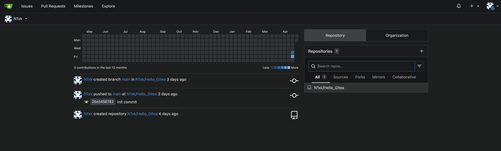

# Gitea (Self-Hosted Git Service)

## Overview

Gitea is used in my homelab as a lightweight self-hosted Git service for managing code repositories. It allows me to host, version, and organize projects in a controlled environment without relying on external platforms.

---

## Purpose

* Host private Git repositories
* Manage version control locally
* Learn self-hosted development workflows
* Understand how Git services operate internally

---

## Features

* Repository hosting and version control
* SSH-based authentication
* Web interface for managing projects
* Lightweight and efficient deployment

---

## Deployment

Gitea is deployed as a containerized service within the homelab.

* Runs inside a Docker container
* Accessible through reverse proxy (`git.home`)
* Uses SSH for secure repository access
* Stores data persistently using mounted volumes

---

## Networking Integration

* Routed through Nginx Proxy Manager for web access
* Integrated with local DNS for clean domain naming
* Accessible remotely through Tailscale without exposing public ports

---

## Example Workflow

```text
Local Machine → Git Push (SSH) → Gitea Server → Repository Storage
```

---

## Challenges & Learning

* Configured SSH keys for secure authentication
* Learned how Git services handle repositories and access control
* Practiced integrating development tools into infrastructure
* Understood storage and persistence for self-hosted services

---

## Notes

Gitea is used as part of my development workflow and helps bridge the gap between software development and infrastructure management.

## Screenshots

<p align="center">
  
</p>

<p align="center">
  <em>Dashboard</em>
</p>
