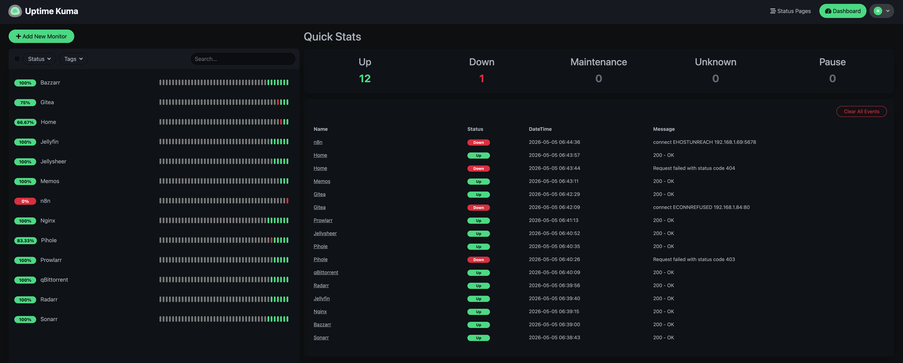

# Uptime Kuma (Monitoring Platform)

## Overview

Uptime Kuma is used in my homelab as a self-hosted monitoring platform to track the availability and health of internal services.

---

## Purpose

* Monitor uptime of critical services
* Detect failures and downtime quickly
* Provide visibility into homelab health
* Reduce blind spots in infrastructure

---

## Features

* HTTP / HTTPS monitoring
* Ping and TCP port checks
* DNS monitoring
* Status pages and uptime history
* Lightweight and self-hosted

---

## Deployment

Uptime Kuma is deployed as a containerized service and accessed through the reverse proxy.

* Accessible via local domain (`kuma.home`)
* Runs inside Docker
* Stores monitoring data persistently

---

## Example Use Cases

* Monitoring Proxmox host availability
* Checking Pi-hole DNS and web interface
* Tracking Jellyfin and media services uptime
* Verifying reverse proxy availability
* Monitoring internal service endpoints

---

## Networking

* Routed through reverse proxy (Nginx Proxy Manager)
* Integrated with local DNS (Pi-hole)
* Accessible remotely through Tailscale

---

## Challenges & Learning

* Learned practical service monitoring strategies
* Understood different health check methods (HTTP, Ping, TCP, DNS)
* Improved troubleshooting by identifying failure points quickly
* Gained experience with observability in small-scale infrastructure

---

## Notes

Uptime Kuma is used to maintain visibility and reliability across the homelab environment.

## Screenshots

  

  <em>Monitoring Dashboard</em>

