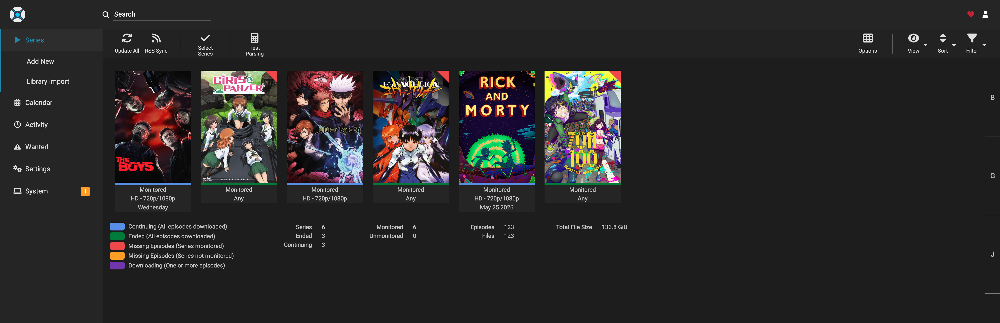

# Media Server / ARR Stack

## Overview

The media server stack is used in my homelab to automate media management and organize content through multiple self-hosted services. It is deployed in a containerized environment and isolated from the rest of the network for better control and safety.

---

## Purpose

* Automate media searching, downloading, and organization
* Centralize media management in one environment
* Learn Docker-based service deployment
* Practice isolated networking and VPN-based routing

---

## Services Included

* **qBittorrent** — download client
* **Sonarr** — TV series management
* **Radarr** — movie management
* **Prowlarr** — indexer management
* **Bazarr** — subtitle management
* **Jellyfin** — media streaming server

---

## Deployment

The stack is deployed using Docker Compose inside a dedicated container/virtualized environment.

The services are configured to work together:

```text
Request/Search → Prowlarr → Sonarr/Radarr → qBittorrent → Media Library → Jellyfin
```

---

## Networking & Isolation

This stack is placed in a separated network/VLAN and uses VPN-based routing for traffic that requires extra privacy and isolation.

This setup helped me understand:

* service isolation
* container networking
* VPN routing
* storage paths and permissions
* multi-service orchestration

---

## Challenges & Learning

* Learned how multiple services communicate with each other
* Troubleshot path and permission issues between containers
* Configured categories and service integrations
* Improved understanding of Docker volumes and persistent storage
* Practiced organizing services in a reliable and maintainable way

---

## Notes

This stack is used as a learning environment for Docker, networking, storage organization, and service orchestration.

## Screenshots
<p align="center">
  
  
  
</p>

<p align="center">
  <em>Jellyfin (Streaming) | Jellyseerr (Requests) | Sonarr (Automation)</em>
</p>