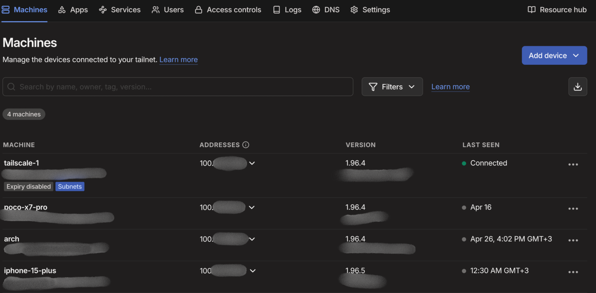

# Tailscale (Secure Remote Access)

## Overview

Tailscale is used in my homelab to provide secure remote access to internal services without exposing them to the public internet. It creates a private network between my devices using a peer-to-peer VPN based on WireGuard.

---

## Purpose

* Enable secure remote access to homelab services
* Avoid exposing services through public ports
* Simplify networking between devices across different locations
* Improve overall security of the infrastructure

---
## Installation

```bash
chmod +x installation.sh
./installation.sh
```
---

## Features

* Peer-to-peer encrypted connections
* No port forwarding required
* Private network between devices
* Easy access to internal services remotely

---

## Deployment

Tailscale is installed on key systems within the homelab and connected to a private network (tailnet).

* Used to access services remotely
* Integrated with internal DNS for service resolution
* Works alongside reverse proxy and local DNS

---

## Networking Integration

Tailscale allows access to internal services as if they were on the same local network.

Example:

```text
Remote Device → Tailscale Network → Homelab → Reverse Proxy → Internal Service
```

This eliminates the need to expose services to the public internet.

---

## Security Approach

* Services are not publicly exposed
* Access is restricted through the Tailscale network
* Reduces attack surface compared to open ports
* Enables secure remote administration

---

## Challenges & Learning

* Learned how overlay networks function
* Understood the importance of secure remote access
* Improved awareness of network exposure and attack surface
* Practiced integrating remote access with internal infrastructure

---

## Notes

Tailscale is a core part of the homelab design, enabling secure, reliable, and convenient access to services from anywhere.

## Screenshots


<p align="center">
  
</p>

<p align="center">
  <em>Left: Dashboard</em>
</p>