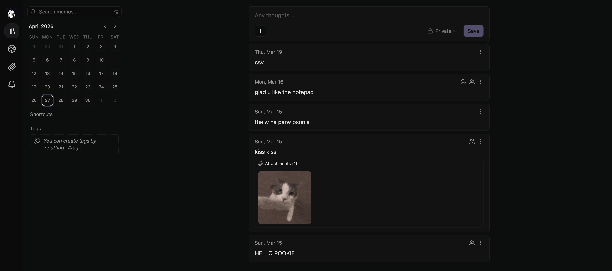

# Memos

## Overview

Memos is a lightweight self-hosted note-taking service used in my homelab for storing and sharing simple notes.

---

## Purpose

* Keep personal notes in a private environment
* Share notes between devices
* Learn deployment of lightweight services

---

## Deployment

Memos is deployed as a containerized service and accessed through the reverse proxy using a local domain.

---

## Networking

* Accessible via local domain (e.g., `memos.home`)
* Routed through reverse proxy
* Available remotely through Tailscale

---

## Notes

This service is used daily and demonstrates how simple applications can be integrated into a larger self-hosted infrastructure.

## Screenshots

  

  <em>Dashboard</em>

