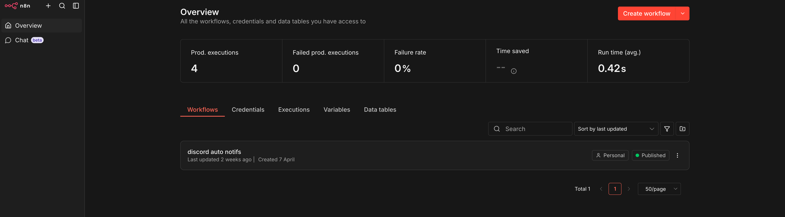

# n8n (Automation Platform)

## Overview

n8n is used in my homelab as a workflow automation platform to connect services and automate repetitive tasks.

---

## Purpose

* Automate routine operations
* Connect different services together
* Reduce manual work within the homelab
* Experiment with event-driven workflows

---

## Features

* Visual workflow builder
* Integration with multiple services
* Trigger-based automation (webhooks, events)
* Lightweight and self-hosted

---

## Deployment

n8n is deployed as a containerized service and accessed through the reverse proxy.

* Accessible via local domain (e.g., `n8n.home`)
* Runs inside Docker
* Stores workflows persistently

---

## Example Use Cases

* Trigger-based workflows using webhooks
* Automating service interactions
* Basic event handling between services

---

## Networking

* Routed through reverse proxy
* Integrated with local DNS
* Accessible remotely through Tailscale

---

## Challenges & Learning

* Learned how event-driven systems work
* Understood workflow automation concepts
* Practiced integrating services through APIs
* Improved ability to design simple automation pipelines

---

## Notes

n8n is used as a learning tool to explore automation and orchestration within a self-hosted environment.

## Screenshots

  

  <em>Dashboard</em>

