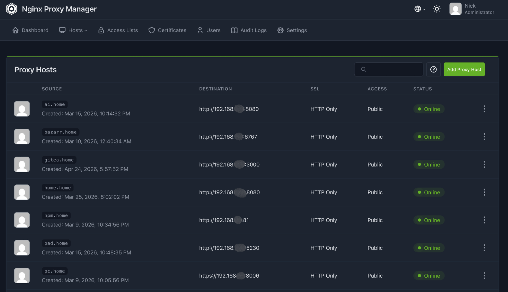

# Nginx Proxy Manager

## Overview

Nginx Proxy Manager is used in my homelab as a reverse proxy to organize and access internal services through readable local domain names instead of IP addresses and ports.

---

## Purpose

* Provide clean local service URLs
* Route traffic to different internal services
* Improve service organization and accessibility
* Keep internal services easier to manage

---

## Features

* Reverse proxy routing for self-hosted services
* Local domain naming using `.home` records
* Centralized service access point
* Easier management of multiple services

---

## Deployment

Nginx Proxy Manager is deployed as a containerized service inside the homelab environment.

It works together with Pi-hole, where local DNS records point service names to the reverse proxy. Nginx Proxy Manager then routes each request to the correct internal service.

Example flow:

```text
service.home → Pi-hole DNS → Nginx Proxy Manager → Internal Service
```

---

## Example Use Cases

* `dashboard.home` → Glance Dashboard
* `memos.home` → Memos
* `git.home` → Gitea
* `media.home` → Media services

---

## Challenges & Learning

* Learned how DNS and reverse proxying work together
* Improved understanding of internal service routing
* Reduced dependency on remembering IP addresses and ports
* Practiced organizing multiple services behind a single access point

---

## Screenshots


<p align="center">
  
</p>

<p align="center">
  <em>Dashboard</em>
</p>