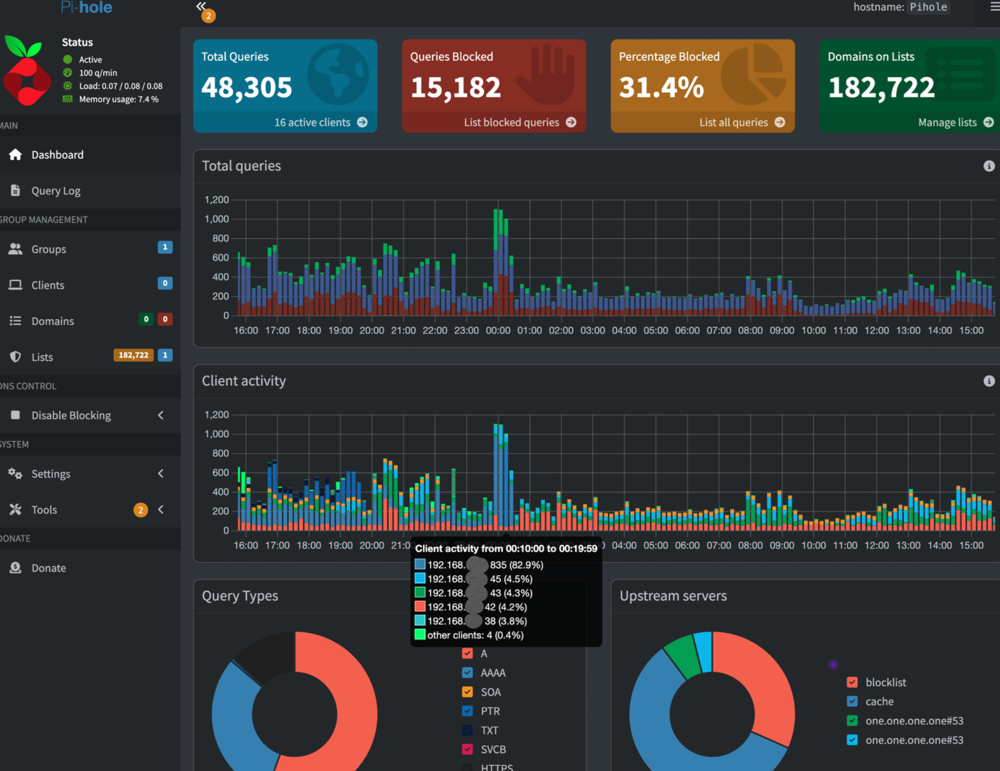
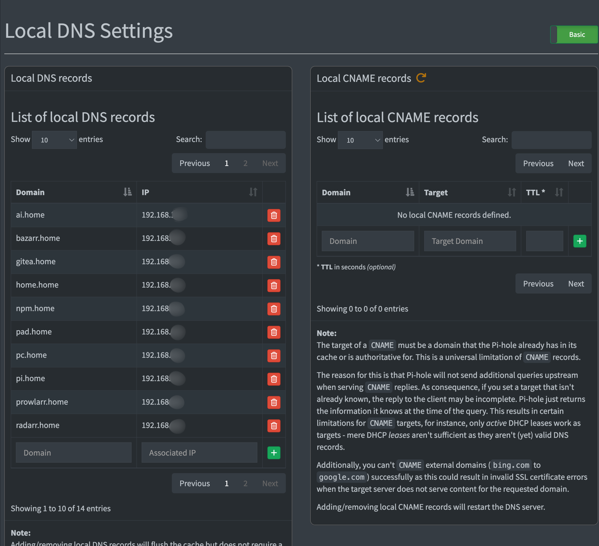

# Pi-hole

## Overview

Pi-hole is deployed in my homelab as a network-wide DNS filtering and local DNS resolution service. It improves network visibility, blocks unwanted traffic, and enables clean service routing across the environment.

---

## Purpose

* Block ads and unnecessary external requests at the network level
* Provide local DNS resolution for internal services
* Act as a central point for monitoring DNS queries

---
## Installation

```bash
chmod +x installation.sh
./installation.sh
```
---

## Features

* Network-wide ad blocking
* Custom DNS records for local services (.home domains)
* Query logging and traffic visibility
* Lightweight and efficient deployment

---

## Deployment

Pi-hole is deployed inside an LXC container within Proxmox.

* Configured as the primary DNS server on the router
* All client traffic is routed through Pi-hole
* Integrated with reverse proxy for internal service naming

---

## Networking

* Used as the main DNS resolver for the network
* Handles local domain routing (e.g., `service.home`)
* Works alongside VLAN segmentation for better control and isolation

---

## Challenges & Learning

* Initial DNS routing required reconfiguration of the router
* Troubleshooting connectivity issues helped improve understanding of network flow
* Learned how DNS resolution impacts service accessibility

---

## Screenshots

<p align="center">
  
  
</p>

<p align="center">
  <em>Left: DNS Configuration | Right: Query Logs</em>
</p>
