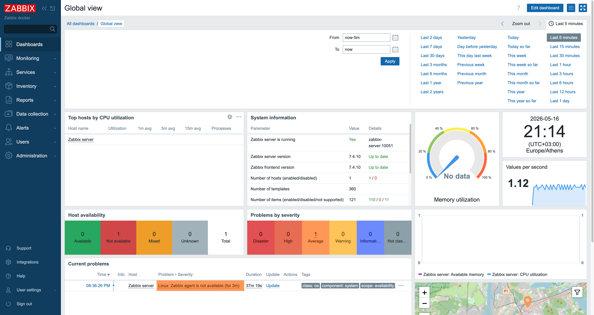

# Zabbix

## Overview

Zabbix is deployed in my homelab as a centralized infrastructure monitoring and alerting platform. It is used to monitor system health, service availability, uptime, resource usage, and network visibility across hosts and self-hosted services.

---

## Purpose

* Monitor infrastructure and service health
* Track CPU, RAM, disk, and network usage across systems
* Detect outages and service interruptions
* Improve visibility into the homelab environment
* Practice monitoring and operational workflows similar to real NOC environments
* Gain hands-on experience with alerting, diagnostics, and incident response concepts

---

## Features

* Host and infrastructure monitoring
* Real-time alerting and incident visibility
* CPU, memory, disk, and network monitoring
* Service availability tracking
* Historical graphs and performance metrics
* Zabbix agent-based monitoring
* Dashboard and visualization support

---

## Deployment

Zabbix is deployed using Docker inside an LXC container hosted on Proxmox.

* PostgreSQL backend database
* Zabbix Server for centralized monitoring
* Zabbix Web UI for dashboards and visualization
* Zabbix Agents installed on monitored systems

Currently monitored systems include:

* Zabbix monitoring server
* Pi-hole DNS server
* Proxmox infrastructure hosts
* Additional Linux-based services and containers

---

## Networking

* Zabbix agents communicate over port `10050`
* Zabbix server listens on port `10051`
* Web interface exposed internally through the homelab network
* Integrated with VLAN-separated infrastructure and local DNS services

---

## Monitoring & Operations

The monitoring environment is used to simulate real operational workflows.

Examples include:

* Service uptime monitoring
* Resource usage tracking
* Host availability checks
* Alert validation and troubleshooting
* Incident-style investigation workflows
* Infrastructure visibility and diagnostics

Monitoring tools used alongside Zabbix include:

* Uptime Kuma
* Proxmox metrics
* Internal DNS monitoring

---

## Challenges & Learning

* Learned how centralized monitoring systems communicate with agents
* Troubleshot connectivity and agent communication issues
* Improved understanding of infrastructure visibility and operational monitoring
* Gained hands-on experience with dashboards, alerts, uptime monitoring, and performance tracking
* Practiced troubleshooting workflows similar to real NOC and systems administration environments
* Developed a better understanding of incident detection and infrastructure diagnostics

---

## Screenshots

  

  <em>Left: Zabbix Dashboard | Right: Host Monitoring Overview</em>

